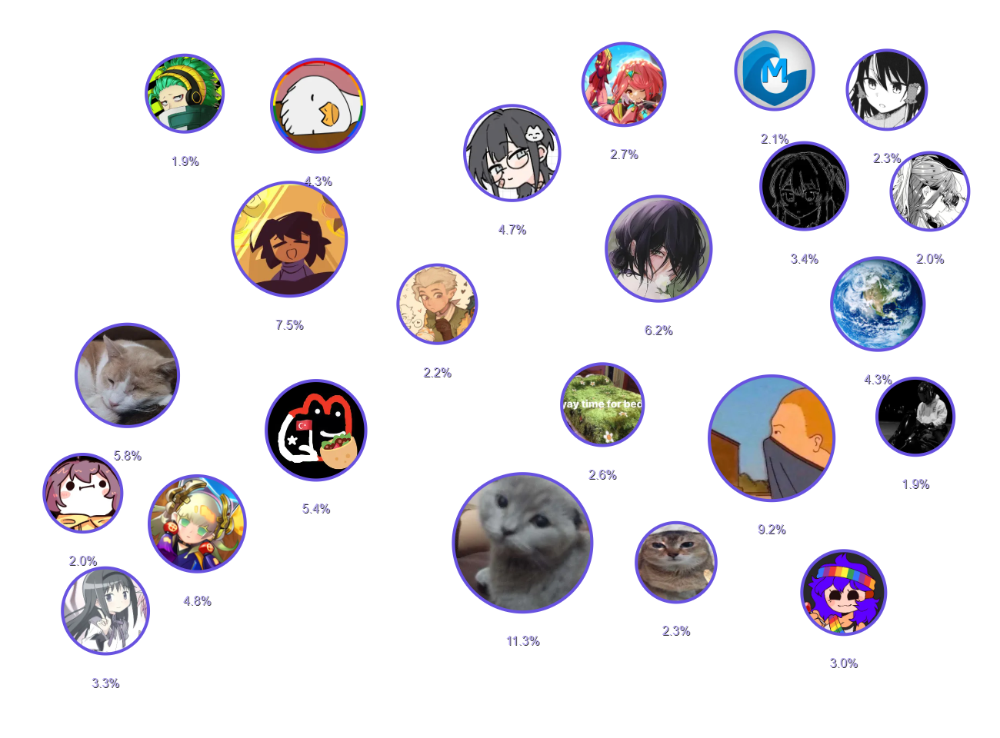

# vc-useraffinities

display your most interacted users in a word cloud!

simply run the /affinities command after installing the plugin.

you can use the `count` option to set the amount of users to display

or use the `algorithm` option to choose the 'algorithm', discord has two versions of the Store (default is V2)

to install it follow instructions on <https://docs.vencord.dev>

## contributing

prs are welcome! feel free to pr whatever improvements come to your mind

## no affinities

this happens if you disabled specific privacy related stuff in your discord account settings, you cant just "load" them instantly it takes some time
